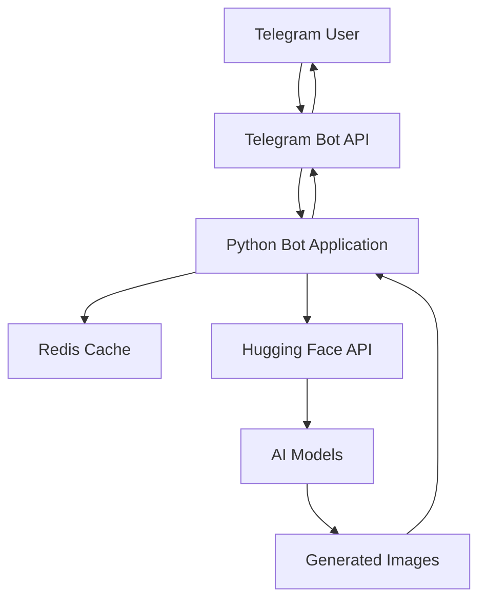

# 🎨 AI Image Generator Telegram Bot

<div align="center">


**Transform your ideas into stunning visuals with the power of AI**

*Generate high-quality images from text descriptions using state-of-the-art AI models*

[🚀 **Deploy Now**](#-quick-deployment) • [📖 **Documentation**](#-features) • [💡 **Examples**](#-usage-examples) • [🛠️ **Setup**](#️-local-development)

</div>

---

## ✨ Features

### 🎯 **Core Capabilities**
- **🖼️ Text-to-Image Generation** - Create stunning images from descriptive text
- **🔍 Image Analysis** - Upload images for detailed AI-powered descriptions
- **🎨 Multiple AI Models** - Choose from premium Flux, Stable Diffusion, and specialized models
- **⚡ Smart Model Selection** - Automatic optimization based on prompt characteristics
- **🔧 Prompt Enhancement** - AI-powered prompt improvement for better results

### 🛡️ **Advanced Features**
- **⏱️ Rate Limiting** - Fair usage with 10 images per hour per user
- **🎛️ User Preferences** - Save favorite models and settings
- **📊 Quality Control** - Automatic image optimization for Telegram
- **🔒 Content Safety** - Built-in content filtering and moderation
- **📱 Mobile Optimized** - Perfect experience on all devices

### 🤖 **Available AI Models**

#### 🎨 **Image Generation Models**
| Model | Category | Speed | Quality | Description |
|-------|----------|-------|---------|-------------|
| **Flux Pro** | Premium | Slow | Highest | Professional-grade with superior detail |
| **Flux1.[dev]** | Advanced | Medium | Very High | Cutting-edge features and quality |
| **Flux1.[schnell]** | Balanced | Fast | High | Perfect speed-quality balance |
| **Flux1.[schnell] Free** | Free | Fast | Good | Free tier with excellent results |
| **Kolor** | Artistic | Medium | High | Vibrant colors and artistic flair |
| **SD 3.5** | Latest | Medium | Very High | Latest Stable Diffusion technology |
| **SDXL** | High-Res | Slow | Very High | Extra-large for detailed images |

#### 🔍 **Analysis Models**
- **Image-to-Text** - Advanced image captioning and analysis
- **Prompt Enhancement** - AI-powered prompt optimization

---

## 🚀 Quick Deployment

### 🌟 **One-Click Deploy on Railway** *(Recommended)*

[](https://railway.app/template/your-template-id)

### 🔧 **Manual Deployment**

<details>
<summary><b>📋 Railway Deployment Guide</b></summary>

1. **Fork this repository** to your GitHub account
2. **Sign up** at [Railway](https://railway.app) with GitHub
3. **Create new project** → Deploy from GitHub repo
4. **Add Redis database** to your project
5. **Set environment variables**:
   ```env
   TELEGRAM_BOT_TOKEN=your_bot_token_here
   HUGGINGFACE_API_KEY=your_hf_api_key_here
   REDIS_URL=your_redis_connection_string
   ```
6. **Deploy automatically** on every Git push!

</details>

<details>
<summary><b>🌐 Render Deployment Guide</b></summary>

1. **Fork repository** and connect to [Render](https://render.com)
2. **Create Web Service** with these settings:
   - **Build Command**: `pip install -r requirements.txt`
   - **Start Command**: `python telegram_bot_complete.py`
3. **Add Redis service** from Render dashboard
4. **Configure environment variables** in service settings
5. **Auto-deploy** from GitHub on every commit

</details>

<details>
<summary><b>☁️ Other Free Platforms</b></summary>

- **Heroku Alternative**: Use [fly.io](https://fly.io) with their free tier
- **Google Cloud**: Deploy on Cloud Run with always-free tier
- **Oracle Cloud**: Use ARM instances with generous free resources
- **Self-hosted**: Deploy on any VPS with Docker support

</details>

---

## 🛠️ Local Development

### 📋 **Prerequisites**

- **Python 3.8+** - [Download Python](https://python.org/downloads/)
- **Redis Server** - [Install Redis](https://redis.io/download)
- **Telegram Bot Token** - Create bot via [@BotFather](https://t.me/botfather)
- **Hugging Face API Key** - Get free key at [HuggingFace](https://huggingface.co)

### ⚡ **Quick Start**

```bash
# 1. Clone the repository
git clone https://github.com/Omega-Open-AI/telegram-draft-bot.git
cd telegram-draft-bot

# 2. Create virtual environment (recommended)
python -m venv venv
source venv/bin/activate  # On Windows: venv\Scripts\activate

# 3. Install dependencies
pip install -r requirements.txt

# 4. Set environment variables
cp .env.example .env  # Copy and edit with your credentials

# 5. Start Redis server
redis-server

# 6. Run the bot
python telegram_bot_complete.py
```

### 🔧 **Environment Setup**

Create a `.env` file in the project root:

```env
# Telegram Bot Configuration
TELEGRAM_BOT_TOKEN=your_telegram_bot_token_here

# Hugging Face API Configuration
HUGGINGFACE_API_KEY=your_huggingface_api_key_here

# Redis Configuration
REDIS_URL=redis://localhost:6379

# Optional: Bot Configuration
MAX_PROMPT_LENGTH=500
RATE_LIMIT_PER_USER=10
DEFAULT_MODEL=black-forest-labs/FLUX.1-schnell-Free
```

---

## 📱 Usage Examples

### 💬 **Basic Commands**

```
/start          - Welcome message and quick start guide
/help           - Detailed usage instructions and tips
/models         - View all available AI models
/generate       - Generate image from prompt
/setmodel       - Set your preferred AI model
/enhance        - Enhance prompts with AI
```

### 🎨 **Example Prompts**

```
🌅 "A serene mountain landscape at sunset with crystal clear lake"
🏰 "Medieval castle on a floating island, fantasy art style"
🤖 "Futuristic robot in cyberpunk city, neon lights, 8k quality"
🎭 "Portrait of wise wizard with glowing staff, digital art"
🚗 "Vintage car driving through autumn forest, cinematic"
```

### 📊 **Advanced Usage**

**Model Selection:**
```
/setmodel flux_pro        # Set premium model for best quality
/setmodel flux_free       # Set free model for faster generation
```

**Prompt Enhancement:**
```
/enhance sunset over ocean
# AI will enhance: "Breathtaking sunset over calm ocean waves, 
# golden hour lighting, professional photography, 8k resolution"
```

**Image Analysis:**
- Simply upload any image to get detailed AI description
- Use descriptions as prompts for similar image generation

---

## 🏗️ Architecture & Technical Details

### 📊 **System Architecture**



### 🔧 **Key Components**

- **`telegram_bot_complete.py`** - Main bot application with all handlers
- **`requirements.txt`** - Python dependencies with version pinning
- **Redis Integration** - Rate limiting, user preferences, caching
- **Image Processing** - PIL-based optimization for Telegram delivery
- **Error Handling** - Comprehensive error management and user feedback

### 📈 **Performance Features**

- **Smart Caching** - Redis-based caching for improved response times
- **Rate Limiting** - User-based limits to ensure fair usage
- **Image Optimization** - Automatic compression and format conversion
- **Async Operations** - Non-blocking API calls for better performance
- **Retry Logic** - Automatic retry for failed API requests

---

## 🤝 Contributing

We welcome contributions! Here's how you can help:

### 🔄 **How to Contribute**

1. **Fork** the repository
2. **Create** a feature branch (`git checkout -b feature/amazing-feature`)
3. **Commit** your changes (`git commit -m 'Add amazing feature'`)
4. **Push** to the branch (`git push origin feature/amazing-feature`)
5. **Open** a Pull Request

### 🐛 **Bug Reports**

Found a bug? Please create an issue with:
- **Description** of the problem
- **Steps to reproduce**
- **Expected behavior**
- **Screenshots** (if applicable)
- **Environment details**

### 💡 **Feature Requests**

Have an idea? We'd love to hear it! Open an issue with:
- **Feature description**
- **Use case/motivation**
- **Proposed implementation** (optional)

---

## 📄 License & Credits

### 📜 **License**
This project is licensed under the MIT License - see the [LICENSE](LICENSE) file for details.

### 🙏 **Acknowledgments**
- **Hugging Face** - For providing excellent AI model APIs
- **Telegram** - For the robust Bot API platform
- **Black Forest Labs** - For the amazing Flux AI models
- **Stability AI** - For Stable Diffusion models
- **Open Source Community** - For the incredible libraries used

### 🌟 **Show Your Support**

If you find this project helpful, please consider:
- ⭐ **Starring** the repository
- 🍴 **Forking** for your own projects
- 📢 **Sharing** with others
- 💖 **Contributing** to make it better

---

<div align="center">

**Made with ❤️ by [Omega Open AI](https://github.com/Omega-Open-AI)**

[🏠 Home](https://github.com/Omega-Open-AI) • [📧 Contact](mailto:contact@omega-openai.com) • [🐦 Twitter](https://twitter.com/omega_openai) • [💼 LinkedIn](https://linkedin.com/company/omega-openai)

</div># 🎨 AI Image Generator Telegram Bot

<div align="center">


**Transform your ideas into stunning visuals with the power of AI**

*Generate high-quality images from text descriptions using state-of-the-art AI models*

[🚀 **Deploy Now**](#-quick-deployment) • [📖 **Documentation**](#-features) • [💡 **Examples**](#-usage-examples) • [🛠️ **Setup**](#️-local-development)

</div>

---

## ✨ Features

### 🎯 **Core Capabilities**
- **🖼️ Text-to-Image Generation** - Create stunning images from descriptive text
- **🔍 Image Analysis** - Upload images for detailed AI-powered descriptions
- **🎨 Multiple AI Models** - Choose from premium Flux, Stable Diffusion, and specialized models
- **⚡ Smart Model Selection** - Automatic optimization based on prompt characteristics
- **🔧 Prompt Enhancement** - AI-powered prompt improvement for better results

### 🛡️ **Advanced Features**
- **⏱️ Rate Limiting** - Fair usage with 10 images per hour per user
- **🎛️ User Preferences** - Save favorite models and settings
- **📊 Quality Control** - Automatic image optimization for Telegram
- **🔒 Content Safety** - Built-in content filtering and moderation
- **📱 Mobile Optimized** - Perfect experience on all devices

### 🤖 **Available AI Models**

#### 🎨 **Image Generation Models**
| Model | Category | Speed | Quality | Description |
|-------|----------|-------|---------|-------------|
| **Flux Pro** | Premium | Slow | Highest | Professional-grade with superior detail |
| **Flux1.[dev]** | Advanced | Medium | Very High | Cutting-edge features and quality |
| **Flux1.[schnell]** | Balanced | Fast | High | Perfect speed-quality balance |
| **Flux1.[schnell] Free** | Free | Fast | Good | Free tier with excellent results |
| **Kolor** | Artistic | Medium | High | Vibrant colors and artistic flair |
| **SD 3.5** | Latest | Medium | Very High | Latest Stable Diffusion technology |
| **SDXL** | High-Res | Slow | Very High | Extra-large for detailed images |

#### 🔍 **Analysis Models**
- **Image-to-Text** - Advanced image captioning and analysis
- **Prompt Enhancement** - AI-powered prompt optimization

---

## 🚀 Quick Deployment

### 🌟 **One-Click Deploy on Railway** *(Recommended)*

[](https://railway.app/template/your-template-id)

### 🔧 **Manual Deployment**

<details>
<summary><b>📋 Railway Deployment Guide</b></summary>

1. **Fork this repository** to your GitHub account
2. **Sign up** at [Railway](https://railway.app) with GitHub
3. **Create new project** → Deploy from GitHub repo
4. **Add Redis database** to your project
5. **Set environment variables**:
   ```env
   TELEGRAM_BOT_TOKEN=your_bot_token_here
   HUGGINGFACE_API_KEY=your_hf_api_key_here
   REDIS_URL=your_redis_connection_string
   ```
6. **Deploy automatically** on every Git push!

</details>

<details>
<summary><b>🌐 Render Deployment Guide</b></summary>

1. **Fork repository** and connect to [Render](https://render.com)
2. **Create Web Service** with these settings:
   - **Build Command**: `pip install -r requirements.txt`
   - **Start Command**: `python telegram_bot_complete.py`
3. **Add Redis service** from Render dashboard
4. **Configure environment variables** in service settings
5. **Auto-deploy** from GitHub on every commit

</details>

<details>
<summary><b>☁️ Other Free Platforms</b></summary>

- **Heroku Alternative**: Use [fly.io](https://fly.io) with their free tier
- **Google Cloud**: Deploy on Cloud Run with always-free tier
- **Oracle Cloud**: Use ARM instances with generous free resources
- **Self-hosted**: Deploy on any VPS with Docker support

</details>

---

## 🛠️ Local Development

### 📋 **Prerequisites**

- **Python 3.8+** - [Download Python](https://python.org/downloads/)
- **Redis Server** - [Install Redis](https://redis.io/download)
- **Telegram Bot Token** - Create bot via [@BotFather](https://t.me/botfather)
- **Hugging Face API Key** - Get free key at [HuggingFace](https://huggingface.co)

### ⚡ **Quick Start**

```bash
# 1. Clone the repository
git clone https://github.com/Omega-Open-AI/telegram-draft-bot.git
cd telegram-draft-bot

# 2. Create virtual environment (recommended)
python -m venv venv
source venv/bin/activate  # On Windows: venv\Scripts\activate

# 3. Install dependencies
pip install -r requirements.txt

# 4. Set environment variables
cp .env.example .env  # Copy and edit with your credentials

# 5. Start Redis server
redis-server

# 6. Run the bot
python telegram_bot_complete.py
```

### 🔧 **Environment Setup**

Create a `.env` file in the project root:

```env
# Telegram Bot Configuration
TELEGRAM_BOT_TOKEN=your_telegram_bot_token_here

# Hugging Face API Configuration
HUGGINGFACE_API_KEY=your_huggingface_api_key_here

# Redis Configuration
REDIS_URL=redis://localhost:6379

# Optional: Bot Configuration
MAX_PROMPT_LENGTH=500
RATE_LIMIT_PER_USER=10
DEFAULT_MODEL=black-forest-labs/FLUX.1-schnell-Free
```

---

## 📱 Usage Examples

### 💬 **Basic Commands**

```
/start          - Welcome message and quick start guide
/help           - Detailed usage instructions and tips
/models         - View all available AI models
/generate       - Generate image from prompt
/setmodel       - Set your preferred AI model
/enhance        - Enhance prompts with AI
```

### 🎨 **Example Prompts**

```
🌅 "A serene mountain landscape at sunset with crystal clear lake"
🏰 "Medieval castle on a floating island, fantasy art style"
🤖 "Futuristic robot in cyberpunk city, neon lights, 8k quality"
🎭 "Portrait of wise wizard with glowing staff, digital art"
🚗 "Vintage car driving through autumn forest, cinematic"
```

### 📊 **Advanced Usage**

**Model Selection:**
```
/setmodel flux_pro        # Set premium model for best quality
/setmodel flux_free       # Set free model for faster generation
```

**Prompt Enhancement:**
```
/enhance sunset over ocean
# AI will enhance: "Breathtaking sunset over calm ocean waves, 
# golden hour lighting, professional photography, 8k resolution"
```

**Image Analysis:**
- Simply upload any image to get detailed AI description
- Use descriptions as prompts for similar image generation

---

## 🏗️ Architecture & Technical Details

### 📊 **System Architecture**


### 🔧 **Key Components**

- **`telegram_bot_complete.py`** - Main bot application with all handlers
- **`requirements.txt`** - Python dependencies with version pinning
- **Redis Integration** - Rate limiting, user preferences, caching
- **Image Processing** - PIL-based optimization for Telegram delivery
- **Error Handling** - Comprehensive error management and user feedback

### 📈 **Performance Features**

- **Smart Caching** - Redis-based caching for improved response times
- **Rate Limiting** - User-based limits to ensure fair usage
- **Image Optimization** - Automatic compression and format conversion
- **Async Operations** - Non-blocking API calls for better performance
- **Retry Logic** - Automatic retry for failed API requests

---

## 🤝 Contributing

We welcome contributions! Here's how you can help:

### 🔄 **How to Contribute**

1. **Fork** the repository
2. **Create** a feature branch (`git checkout -b feature/amazing-feature`)
3. **Commit** your changes (`git commit -m 'Add amazing feature'`)
4. **Push** to the branch (`git push origin feature/amazing-feature`)
5. **Open** a Pull Request

### 🐛 **Bug Reports**

Found a bug? Please create an issue with:
- **Description** of the problem
- **Steps to reproduce**
- **Expected behavior**
- **Screenshots** (if applicable)
- **Environment details**

### 💡 **Feature Requests**

Have an idea? We'd love to hear it! Open an issue with:
- **Feature description**
- **Use case/motivation**
- **Proposed implementation** (optional)

---

## 📄 License & Credits

### 📜 **License**
This project is licensed under the MIT License - see the [LICENSE](LICENSE) file for details.

### 🙏 **Acknowledgments**
- **Hugging Face** - For providing excellent AI model APIs
- **Telegram** - For the robust Bot API platform
- **Black Forest Labs** - For the amazing Flux AI models
- **Stability AI** - For Stable Diffusion models
- **Open Source Community** - For the incredible libraries used

### 🌟 **Show Your Support**

If you find this project helpful, please consider:
- ⭐ **Starring** the repository
- 🍴 **Forking** for your own projects
- 📢 **Sharing** with others
- 💖 **Contributing** to make it better

---

<div align="center">

**Made with ❤️ by [Omega Open AI](https://github.com/Omega-Open-AI)**

[🏠 Home](https://github.com/Omega-Open-AI) • [📧 Contact](mailto:contact@omega-openai.com) • [🐦 Twitter](https://twitter.com/omega_openai) • [💼 LinkedIn](https://linkedin.com/company/omega-openai)

</div>
